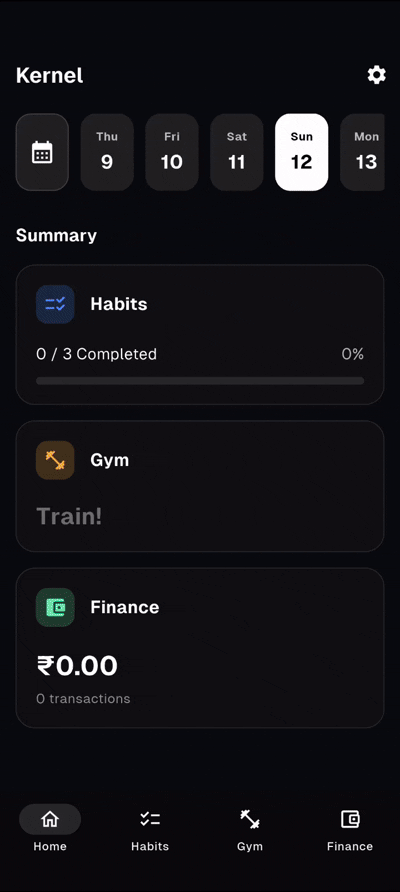

# Kernel: Manage Everything

A unified personal dashboard to beautifully track gym progress, and finances all in one place.

### Preview

<p align="center">
  
</p>

### Built With


---

## 1. Setup

Follow these steps to get the project running locally:

1.  **Clone the Repository**:
    ```bash
    git clone https://github.com/0xCyKat/Kernel.git
    cd kernel
    ```

2.  **Install Dependencies**:
    Ensure you have the [Flutter SDK](https://docs.flutter.dev/get-started/install) installed.
    ```bash
    flutter pub get
    ```

3.  **Firebase Configuration**:
    *   This project uses Firebase for Authentication and Firestore.
    *   Run `flutterfire configure` to set up your project or add your `google-services.json` (Android) and `GoogleService-Info.plist` (iOS) files to the respective directories.

4.  **Run the App**:
    ```bash
    flutter run
    ```

---

## 2. Folder Structure

The project follows a clean, modular architecture to ensure maintainability and scalability:

| Folder | Description |
| :--- | :--- |
| `lib/models/` | Core data classes and serialization logic (Expense, Category, etc.). |
| `lib/screens/` | Main UI views grouped by feature (Finance, Gym, Home, Settings). |
| `lib/services/` | Business logic and backend service layers (Auth, Firestore). |
| `lib/utils/` | Centralized constants, unified theme data, and shared helpers. |
| `lib/widgets/` | Reusable UI components (BentoCard, Sparkline, Calendar). |
| `assets/` | Local assets including images, fonts, and screenshots. |

---

## 3. Release Build Command

To generate a production-ready release for Android, use the following command. 

> [!IMPORTANT]
> The `--no-tree-shake-icons` flag is **required** because the app uses dynamic icon lookups for financial categories.

```bash
flutter build apk --release --no-tree-shake-icons
```

The resulting APK will be located at:
`build/app/outputs/flutter-apk/app-release.apk`
